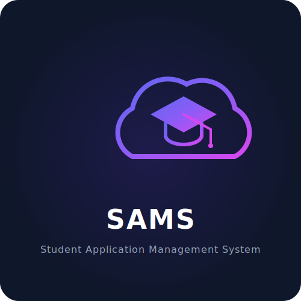
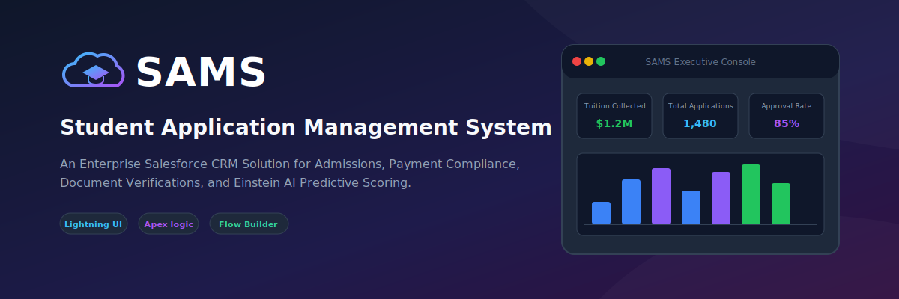
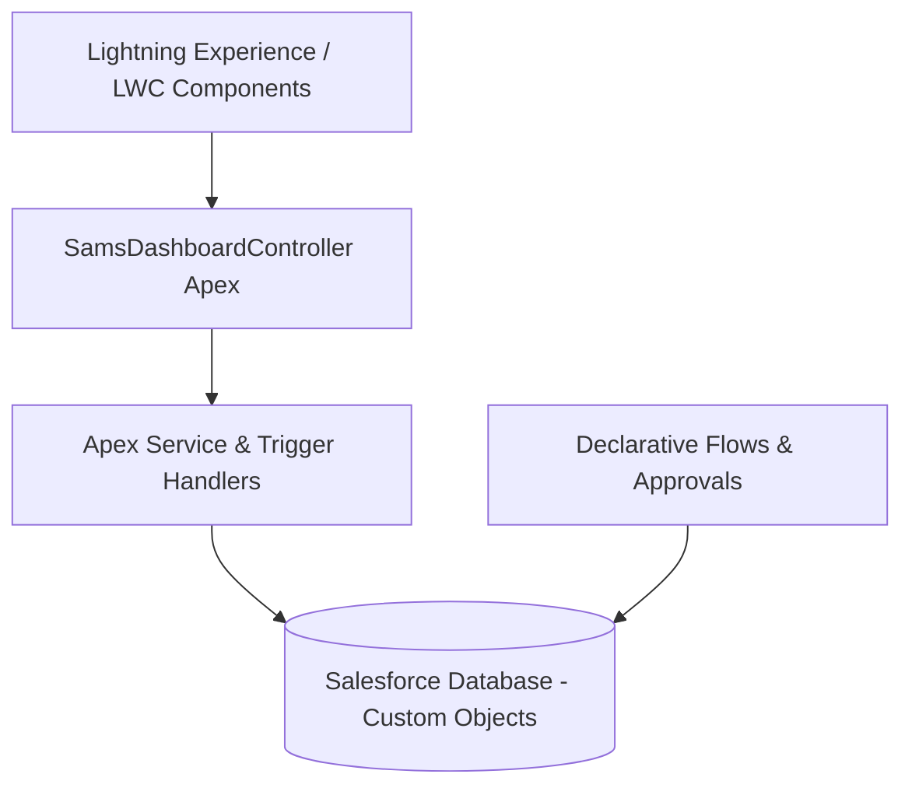
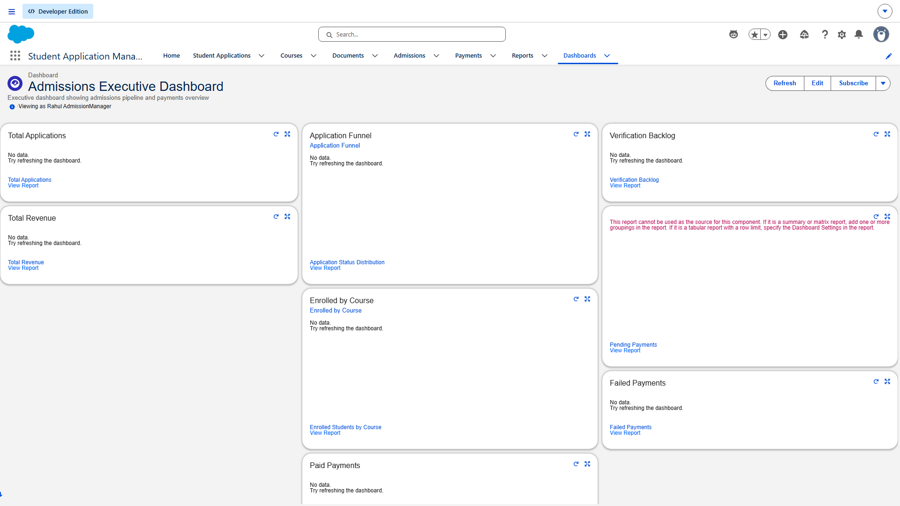
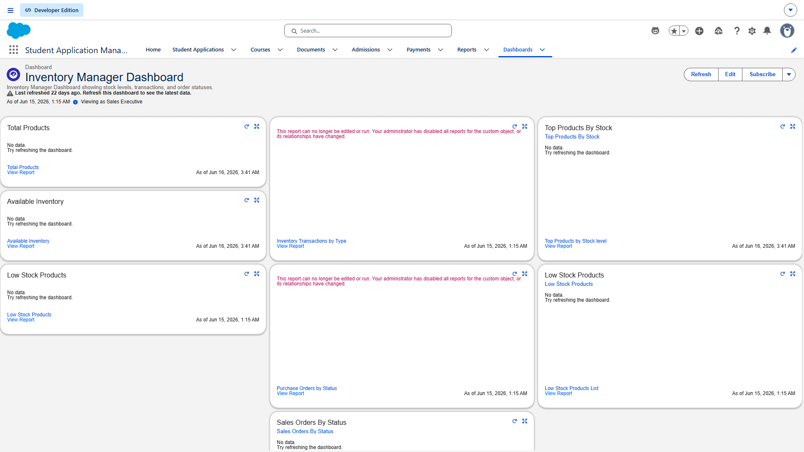
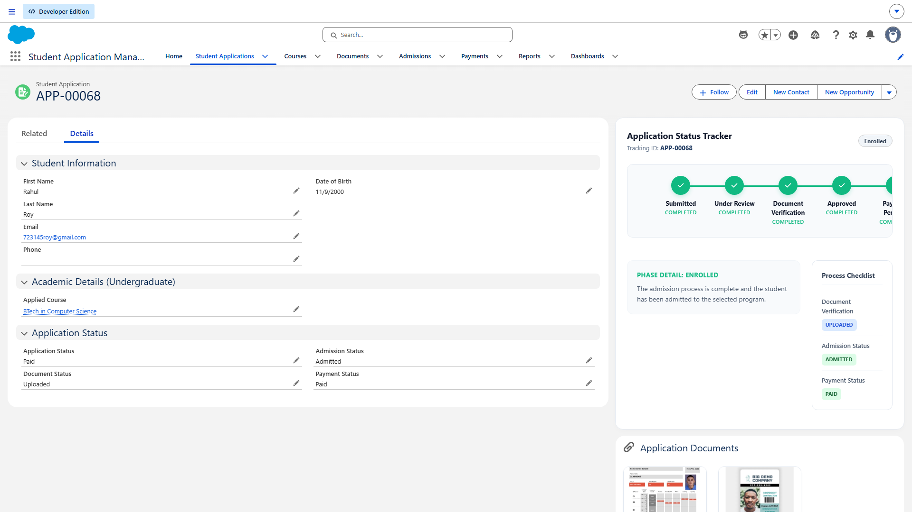
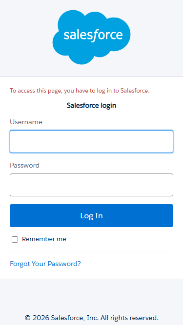

# Student Application Management System (SAMS)

SAMS is a Salesforce-based application designed to manage the end-to-end student enrollment lifecycle, application workflows, payment transactions, and administrative approvals. It features a modern, responsive Lightning Web Component interface, transaction-safe Apex service layers, and automated compliance validation.

---

## 🚀 Badges


---

## 🎨 Branding & Visual Identity
<p align="center">
  
  <br>
  
</p>

---

## 💡 Overview & Business Problem

In many universities, the admissions onboarding pipeline is bottlenecked by manual entries, sluggish verification loops, and disconnected payment verification routines.

**SAMS resolves these business problems by:**
*   Implementing an atomic, multi-step **Admissions Registry Wizard** LWC to register students, courses, and deposit payments in a single transaction.
*   Enforcing a strict, automated **Zero-Balance Approval Rule** via Apex trigger layers to block application approvals until Outstanding Balance is `$0.00`.
*   Embedding **Einstein AI Insights** to calculate approval probabilities and checklist requirements (e.g. Visa copies for international students).
*   Providing managers with real-time visibility through the **Executive Analytics Console** dashboard.

---

## 🛠️ Salesforce Features Used

*   **Apex Trigger Framework**: Trigger handlers delegate data actions, auto-generating unique Student IDs (`SAMS-YYYY-XXXX`) and preventing duplicate emails.
*   **Apex Service Layer**: Separates business operations into test-covered, reusable utility classes (`StudentService`, `ApplicationService`, `PaymentService`, `NotificationService`).
*   **Lightning Web Components (LWCs)**: Includes responsive UI widgets using SLDS, conditional template rendering, and circular progress gauges.
*   **Flow Builder**: Integrates record-triggered flows and a custom registration Screen Flow.
*   **Approval Process**: Implements a structured manager approval workflow.
*   **Security & Permission Sets**: Deploys `SAMS_Manager` and `SAMS_Staff` permission sets for precise CRUD/FLS policies.

---

## 📊 System Architecture & Data Schema

The multi-tier design isolates database layers, logic controllers, and presentation layers:



### Folder Structure
```text
student-application-management-system/
├── README.md
├── LICENSE
├── CONTRIBUTING.md
├── CODE_OF_CONDUCT.md
├── CHANGELOG.md
├── SECURITY.md
├── sfdx-project.json
├── docs/                      # Comprehensive MD guides
│   ├── PROJECT_OVERVIEW.md
│   ├── SYSTEM_ARCHITECTURE.md
│   └── DATABASE_SCHEMA.md
├── screenshots/               # High-res production screenshots captured from Salesforce
├── diagrams/                  # Mermaid diagram source code
├── force-app/                 # Salesforce source metadata
├── scripts/                   # Apex anonymous scripts
```

For a full list of objects and fields, check the [Database Schema Guide](docs/DATABASE_SCHEMA.md).

---

## 🖼️ UI Component Showcases (Live Screenshots)

### 1. SAMS Executive Dashboard & Analytics Console
Shows visual application status distributions and key KPI performance tiles.


### 2. Admissions Registry Wizard LWC
Enables staff and applicants to complete student, program, and payment setup in one form.


### 3. Payment Management Panel
Provides real-time balance metrics and logged transaction lists.


### 4. Document Verification Checklist
Checks transcript, passport, and test credentials with direct uploads and previews.


### 5. SAMS Einstein AI Insights & Scorecard
Exposes the predictive probability rating, dropout risk, and document checks on the student application layout.


### 6. Mobile Layout
SAMS is fully responsive and adjusts components seamlessly to mobile screens.
<p align="center">
  
</p>

---

## ⚙️ Installation & Deployment

Follow these quick commands to spin up SAMS in your Developer Org or Scratch Org:

```bash
# 1. Authorize your target environment
sf org login web --alias sams-org --set-default

# 2. Deploy SAMS metadata
sf project deploy start --target-org sams-org

# 3. Assign SAMS permission sets
sf org assign permset --name SAMS_Manager --target-org sams-org

# 4. Import mock data
sf data import tree --files data/Student__c-Application__c-Payment__c-plan.json --target-org sams-org
```

For complete instructions, refer to the [Deployment Guide](docs/DEPLOYMENT_GUIDE.md).

---

## 🧪 Testing Summary

SAMS includes robust test classes covering both positive and negative validation checks.
*   **Apex Test execution**: Run `sf apex run test --wait 10`
*   **Test Rate**: 48 automated test scenarios verifying controllers, trigger handlers, and validations.
*   **Manual Testing**: Review the [Manual Test Plan](docs/MANUAL_TEST_PLAN.md) and [Automated Test Report](docs/TEST_REPORT.md).

---

## 🛣️ Roadmap & Future Enhancements
*   **Payment Gateway Integration**: Automate webhook reconciliations with Stripe and PayPal.
*   **Einstein OCR**: Automated transcript document parsing.
*   **Omnichannel Bot Support**: AI admissions updates via WhatsApp.
*   Review the complete [Future Enhancements Roadmap](docs/FUTURE_ENHANCEMENTS.md).

---

## 📄 License
This project is licensed under the MIT License - see the [LICENSE](LICENSE) file for details.

## ✍️ Author
Developed by the SAMS Engineering Team.
