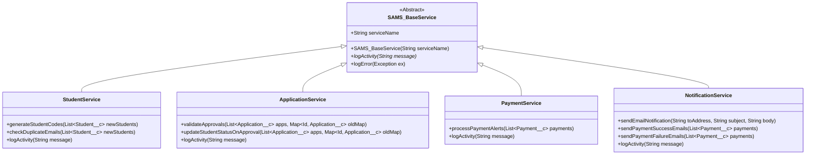

# Application Architecture: SAMS

SAMS utilizes standard Apex programming design patterns to separate business rules from controller calls and data triggers.

## 1. Inheritance & Base Service Design
All service classes extend a custom abstract base class, `SAMS_BaseService`. This ensures consistent activity logging, structured exception logging, and unified transaction boundaries.

## 2. Trigger Delegation Pattern
Database triggers are designed to be thin, routing execution context to corresponding Trigger Handler classes:
1.  **Trigger**: Intercepts `insert/update` operations and instantiates the handler.
2.  **Handler**: Separates operations by events (`before insert`, `after update`, etc.) and invokes the appropriate logic inside the Service Layer.
3.  **Service**: Executes the business rules and updates related records.

## 3. Transaction Boundary Management
For actions that modify multiple objects (such as `createQuickEnrollment` inside `SamsDashboardController`), SAMS uses database Savepoints:
*   An atomic savepoint is set before the transactions: `Savepoint sp = Database.setSavepoint();`
*   If student, application, or payment creation fails, the transaction is rolled back: `Database.rollback(sp);`
*   A user-friendly exception is thrown back to the UI component using `AuraHandledException`.
