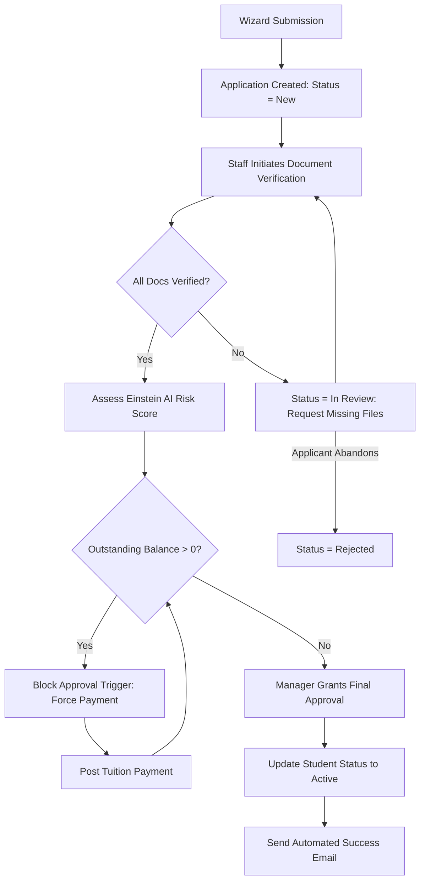
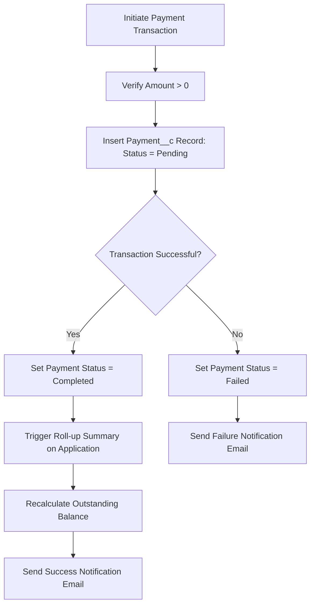

# Business Processes & Workflows: SAMS

This document details the core lifecycle and financial processing flows in SAMS.

---

## 1. Application Lifecycle & Approval Flow

This flow maps how a student's application moves from creation, through verification, financial checks, and final approval/rejection.

---

## 2. Payment Collections & Balance Reconciliation

This flow maps how payments are processed, roll-ups are calculated, and balance alerts are triggered.

| Step | Action | Outcome |
| :--- | :--- | :--- |
| **1** | Initiate Deposit | Payments can be created via wizard or the Payment Management component. |
| **2** | Amount Validation | Validation rule blocks transactions where amount is $\le 0$. |
| **3** | Transaction Logic | System tracks transition. Roll-up sums completed amounts. |
| **4** | Notification Trigger | Apex code sends transactional alerts to target student email. |
