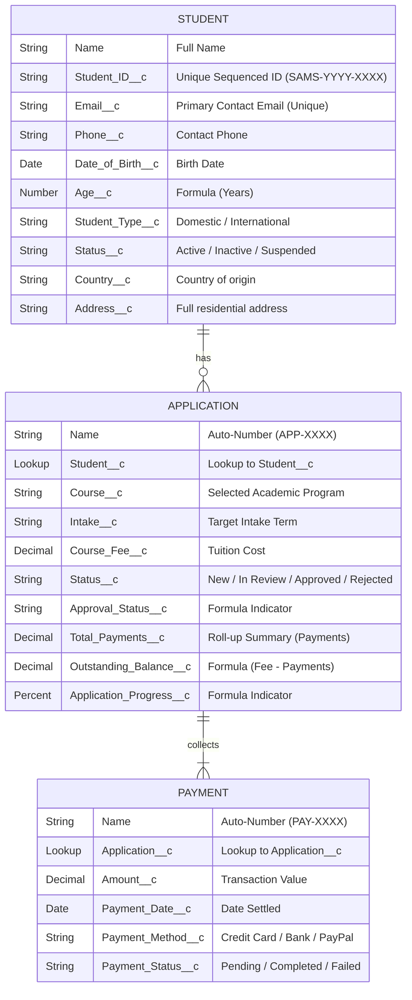

# Database Schema & Entity Dictionary: SAMS

This document provides a detailed schema dictionary of the custom objects and fields implemented in the SAMS application.

## 1. Entity Relationship Diagram (ERD)



## 2. Field Dictionary & Metadata Configuration

### Student__c
*   **Object Label**: Student
*   **Plural Label**: Students
*   **Name Field**: Student Name (Text)
*   **Key Fields**:
    *   `Student_ID__c`: Unique, External ID field. Indexed. Format generated dynamically by trigger: `SAMS-YYYY-XXXX`.
    *   `Email__c`: Email field with system uniqueness rule checked.
    *   `Age__c`: Formula field calculating age from birth date:
        ```text
        FLOOR((TODAY() - Date_of_Birth__c) / 365.2425)
        ```

### Application__c
*   **Object Label**: Application
*   **Plural Label**: Applications
*   **Name Field**: Application Number (Auto-Number: `APP-{0000}`)
*   **Key Fields**:
    *   `Student__c`: Lookup relation back to the Student. Required.
    *   `Total_Payments__c`: Roll-up Summary field calculating the `SUM` of related `Payment__c.Amount__c` where `Payment_Status__c = 'Completed'`.
    *   `Outstanding_Balance__c`: Formula field displaying tuition balance:
        ```text
        Course_Fee__c - Total_Payments__c
        ```
    *   `Application_Progress__c`: Formula field returning percent of tuition paid:
        ```text
        IF(Course_Fee__c > 0, Total_Payments__c / Course_Fee__c, 0)
        ```

### Payment__c
*   **Object Label**: Payment
*   **Plural Label**: Payments
*   **Name Field**: Payment Number (Auto-Number: `PAY-{0000}`)
*   **Key Fields**:
    *   `Application__c`: Lookup relation back to the Application. Required.
    *   `Amount__c`: Decimal currency field representing paid money. Must be non-negative.
