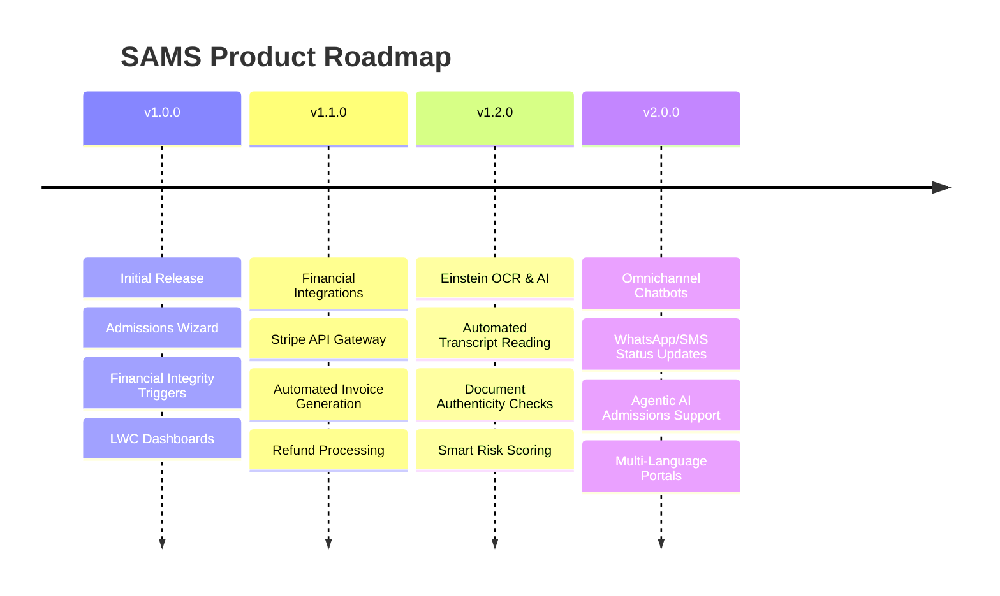

# Future Enhancements & Product Roadmap: SAMS

This document outlines planned features and extensions for subsequent releases of the Student Application Management System (SAMS).

---

## Roadmap Features

---

## Details of Planned Enhancements

### 1. Payment Gateway API Integration (v1.1.0)
*   **Objective**: Replace manual payment entry with real-time digital transaction processing.
*   **Integration**: Connect SAMS directly to **Stripe** or **PayPal** APIs via Salesforce Named Credentials and Apex Callouts.
*   **Logic**: Successful Stripe webhook events will automatically insert `Payment__c` records, updating tuition balances and triggering registration flow steps instantly.

### 2. Document Parsing with Einstein OCR (v1.2.0)
*   **Objective**: Automate high school transcript audit tasks.
*   **Execution**: Integrate Salesforce **Einstein Document Reader (OCR)**.
*   **Logic**: On document upload, the AI reads GPA, school names, and graduation dates, automatically matching them to application records and setting document status to `Verified` if criteria are met.

### 3. Agentic AI Chatbots & Omnichannel Notifications (v2.0.0)
*   **Objective**: Improve applicant response rates and lower staff support loads.
*   **Execution**: Build an admissions assistant chatbot using **Agentforce** to answer prospective students' application status questions.
*   **Alerts**: Integrate **Salesforce Digital Engagement** (SMS and WhatsApp) to send status and document checklist reminders automatically.
